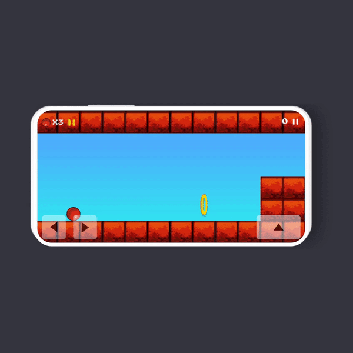
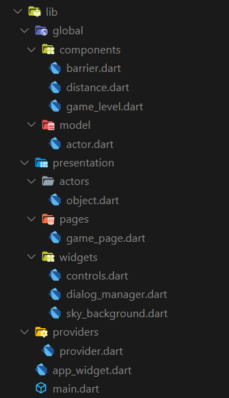

[](https://github.com/Shadow60539/bounce_app) (https://github.com/Shadow60539/bounce_game)              


# Bounce Flutter

Bounce game built in flutter

## Summary
Flutter is pretty cool. This is just a small project I did to
test it out. There are no tests and the code quality is what you'd expect
from a weekend hack.

## Demo



## How To Use

To clone and run this application, you'll need [Git](https://git-scm.com) and [Flutter](https://flutter.dev/docs/get-started/install) installed on your computer. From your command line:

```bash
# Clone this repository
$ git clone https://github.com/Shadow60539/bounce_app.git

# Go into the repository
$ cd bounce_app.git

# Install dependencies
$ flutter packages get

# Run the app
$ flutter run
```

### Directory Structure

The project directory structure is as follows:

```
├── android
├── asset
├── build
├── images
├── ios
├── lib
├── pubspec.lock
├── pubspec.yaml

```

Other directories besides **lib**:

directory | explain
---|---
images | readme images files
asset | images 

Then the lib directory





### License
````
Copyright 2021 Sanjeev Madhav

Permission is hereby granted, free of charge, to any person obtaining a copy of this software and associated documentation files (the "Software"), to deal in the Software without restriction, including without limitation the rights to use, copy, modify, merge, publish, distribute, sublicense, and/or sell copies of the Software, and to permit persons to whom the Software is furnished to do so, subject to the following conditions:

The above copyright notice and this permission notice shall be included in all copies or substantial portions of the Software.

THE SOFTWARE IS PROVIDED "AS IS", WITHOUT WARRANTY OF ANY KIND, EXPRESS OR IMPLIED, INCLUDING BUT NOT LIMITED TO THE WARRANTIES OF MERCHANTABILITY, FITNESS FOR A PARTICULAR PURPOSE AND NONINFRINGEMENT. IN NO EVENT SHALL THE AUTHORS OR COPYRIGHT HOLDERS BE LIABLE FOR ANY CLAIM, DAMAGES OR OTHER LIABILITY, WHETHER IN AN ACTION OF CONTRACT, TORT OR OTHERWISE, ARISING FROM, OUT OF OR IN CONNECTION WITH THE SOFTWARE OR THE USE OR OTHER DEALINGS IN THE SOFTWARE.
````
